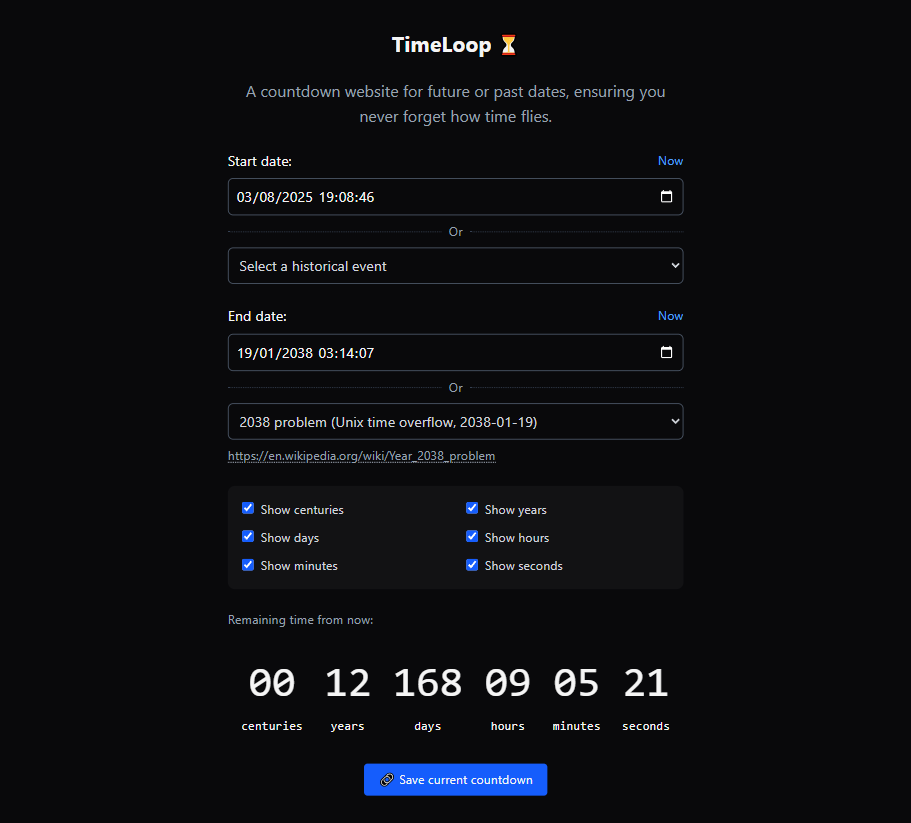

# ⏳ TimeLoop

## In French

> [!IMPORTANT]
> Depuis mars 2026, le code du projet est désormais hébergé sur mon instance GitLab personnalisée, accessible à [cette adresse](https://git.florian-dev.fr/floriantrayon/TimeLoop). Le dépôt GitHub est un miroir du dépôt GitLab, **mis à jour automatiquement**.
>
> **Les contributions publiques restent sur GitHub et sont les bienvenues** ; les pull requests validées y seront ensuite transférées manuellement sur GitLab pour être intégrées. 🙂

### Introduction

Ce projet, sous la forme d'un petit site Internet, a été réalisé quelques temps après la disparition d'un proche. C'est dans ces moments-là que l'on prend pleinement conscience de la valeur particulière du temps. C'est pourquoi j'ai décidé de me lancer dans la création de ce projet : un compte à rebours permettant d'estimer facilement et simplement les temps restants ou écoulés depuis un événement historique ou une date personnalisée définie par l'utilisateur, afin de **ne jamais oublier à quel point le temps passe**.

Ce projet a été réalisé avec [Svelte](https://svelte.dev/) 🚀, s'appuie sur la bibliothèque [NumberFlow](https://number-flow.barvian.me/svelte), et ne propose pas de fonctionnalités avancées pour éviter d'utiliser un quelconque serveur back-end. Il s'agit donc d'un site totalement statique qui peut être hébergé sur n'importe quel serveur Web.

> [!NOTE]
> Tout ou partie du code peut contenir des commentaires dans ma langue natale (le français) afin de faciliter le développement. 🌐

### Installation

> [!WARNING]
> Le déploiement en environnement de production nécessite un serveur Web déjà configuré comme [Nginx](https://nginx.org/en/), [Apache](https://httpd.apache.org/) ou [Caddy](https://caddyserver.com/) pour servir les fichiers statiques générés par Vite. ⚠️

#### Développement local

- Installer [NodeJS LTS](https://nodejs.org/) (>20 ou plus) ;
- Installer les dépendances du projet avec la commande `npm install` ;
- Démarrer le serveur local Vite avec la commande `npm run dev`.

#### Déploiement en production

- Installer [NodeJS LTS](https://nodejs.org/) (>20 ou plus) ;
- Installer les dépendances du projet avec la commande `npm install` ;
- Compiler les fichiers statiques du site Internet avec la commande `npm run build` ;
- Utiliser un serveur Web pour servir les fichiers statiques générés à l'étape précédente.

## In English

> [!IMPORTANT]
> Since March 2026, the project's code has been hosted on my custom GitLab instance, available at [this address](https://git.florian-dev.fr/floriantrayon/TimeLoop). The GitHub repository is a mirror of the GitLab repository, **automatically kept up to date**.
>
> **Public contributions remain on GitHub and are welcome**; validated pull requests will then be manually transferred to GitLab to be integrated. 🙂

### Introduction

This project, a small website, was created shortly after the death of a family member. That's when you really realize how valuable time is. That is why I decided to start this project: a countdown that makes it easy to estimate the time remaining or elapsed since a historical event or a custom date defined by the user, to never forget how time flies.

This project was created with [Svelte](https://svelte.dev/) 🚀, is based on the [NumberFlow](https://number-flow.barvian.me/svelte) library, and does not offer any advanced features to avoid using any back-end server. This is a completely static site that can be hosted on any web server.

> [!NOTE]
> All or part of the code may contain comments in my native language (French) to ease development. 🌐

### Setup

> [!WARNING]
> Deployment in a production environment requires a pre-configured web server such as [Nginx](https://nginx.org/en/), [Apache](https://httpd.apache.org/), or [Caddy](https://caddyserver.com/) to serve the static files generated by Vite. ⚠️

#### Local development

- Install [NodeJS LTS](https://nodejs.org/) (>20 or higher) ;
- Install project dependencies using `npm install` ;
- Start Vite local server using `npm run dev`.

#### Production deployment

- Install [NodeJS LTS](https://nodejs.org/) (>20 or higher) ;
- Install project dependencies using `npm install` ;
- Build static website files using `npm run build` ;
- Remove development dependencies using `npm prune --omit=dev` ;
- Use a web server to serve the static files generated in the previous step.

